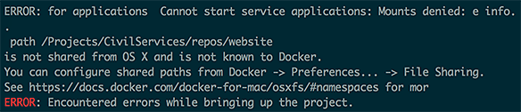
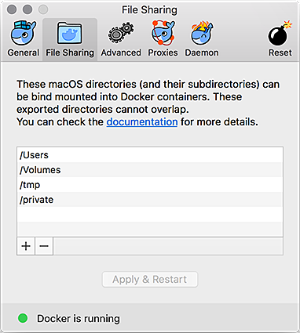

**[↤ Developer Overview](../README.md)**

Troubleshooting
===

Docker Errors
---

### `ERROR: for applications Cannot start service applications: Mounts denied: e info.`

If you see an error that looks like this:

It is because the root directory ( in the example above `/Projects` ) is not listed in Docker's __File Sharing__ tab.  To add your root directory, simply open up Dockers Preferences, select __File Sharing__ and add the root folder to the list.  Then you can rerun your Docker command without issue.

